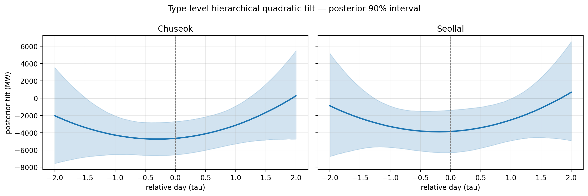
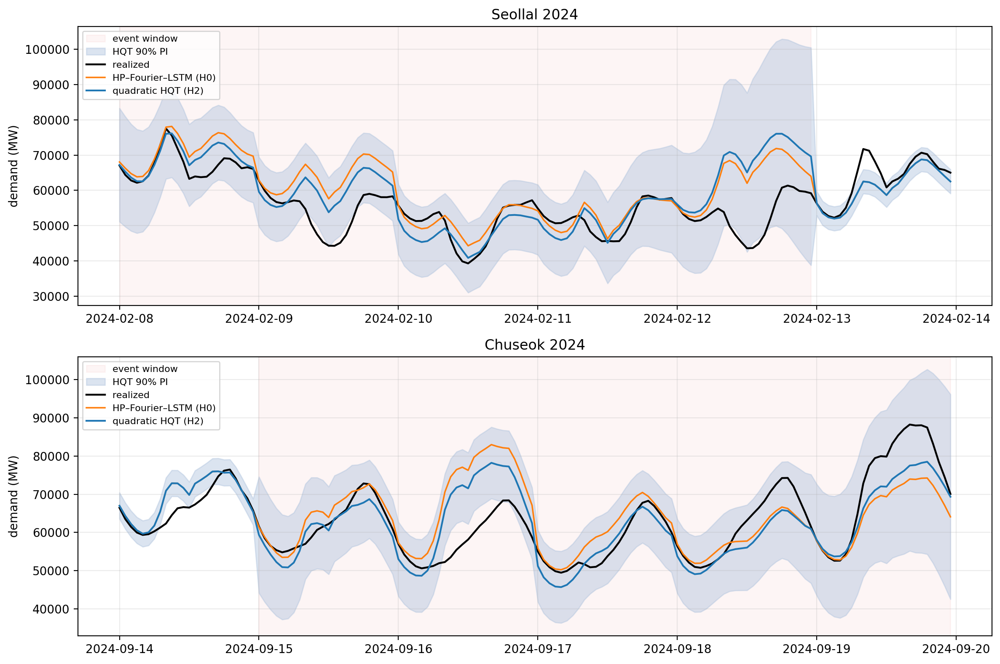
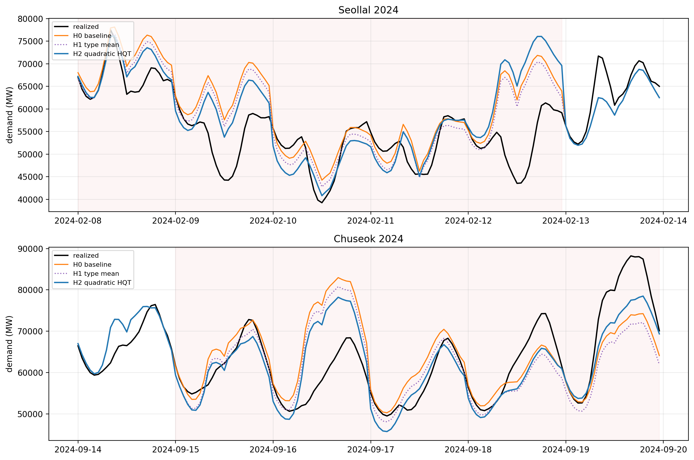

# HP–Fourier–Seq2Seq-LSTM + Quadratic HQT notebook rerun

이 디렉터리는 기존 Jupyter notebook의 하이브리드 베이스라인을 재현하고,
명절 잔차에 **계층 이차 틸트만** 적용한 최종 실행 번들이다. 별도의
대체공휴일 점프 절편은 사용하지 않는다. 작업 중인 `src/` 노트북은 건드리지
않고, 출력 없는 canonical source와 전체 실행 출력이 담긴 executed notebook을
분리해 저장했다.

## 모형 사양

베이스라인은 다음 세 성분의 합이다.

```text
hybrid forecast
  = HP-filter trend
  + Fourier seasonality
  + Seq2Seq-LSTM forecast of the Fourier residual
```

- HP filter: `lambda = 1.28e8`
- Fourier validation 선택: daily `K=3`, weekly `K=8`, yearly `K=1`
- LSTM: 128 hidden units, 3 layers
- 입력: 168시간, 출력: 24시간, stride 24시간
- LSTM 입력: 습도, 기온, Fourier residual, 계절 더미, 공휴일 더미
- 장치: Apple MPS 자동 선택 및 실행 확인
- train: 2019–2022, validation: 2023, test: 2024-01-08~2024-10-31

HQT는 2019–2022 train의 설날·추석 8개 이벤트로 적합하고, 2023년은
validation으로 그대로 유지한다. 2024년의 두 이벤트에는 학습에서 보지 않은
새 이벤트용 posterior predictive curve를 적용한다.

```text
z_i,t = beta_i0 + beta_i1 * tau + beta_i2 * tau^2 + epsilon_i,t

beta_i | h(i) ~ Normal(mu_h(i), Sigma_h(i))
Sigma_h = L_h L_h^T,  L_h ~ LKJ-Cholesky
```

공식 명절 3일과 앞뒤 각 1일을 합쳐 이벤트별 120시간 윈도를 사용한다. 신규
이벤트에서 뽑은 하나의 `beta_new` posterior draw path를 이벤트 전체 시간에
공유해 시간별 보정곡선의 일관성을 유지한다.

## 실행

canonical notebook을 다시 만들고 전체 실행한다.

```bash
uv sync --extra dev
uv run python scripts/build_hybrid_hqt_notebook.py
uv run python scripts/run_hybrid_hqt_notebook.py
```

실행 연결만 점검할 때는 다음을 사용한다.

```bash
uv run python scripts/run_hybrid_hqt_notebook.py \
  --quick --output-dir artifacts/hybrid_hqt_notebook_quadratic_quick
```

전체 실행 설정은 4 chains, chain당 5,000 posterior draws, tune 3,000,
`target_accept=0.99`다.

## 결과

모든 오차 단위는 MW다.

| 범위 | n | Baseline MAE | HQT MAE | MAE 개선 | Baseline RMSE | HQT RMSE | RMSE 개선 |
|---|---:|---:|---:|---:|---:|---:|---:|
| 전체 test | 7,152 | 1,992.7 | 1,973.1 | 0.98% | 3,080.0 | 3,012.4 | 2.20% |
| 이벤트 윈도 | 240 | 5,800.1 | 5,216.2 | 10.07% | 8,171.1 | 7,381.3 | 9.67% |
| 공식 설날·추석 | 168 | 6,260.3 | 5,969.6 | 4.64% | 8,818.0 | 8,283.2 | 6.06% |

공식 명절 bias는 `+4,971.2 → +2,737.1 MW`로 44.9% 감소했다. 단순한 유형별
평균보정(H1)과 비교해도 이벤트 윈도 MAE는 `5,533.2 → 5,216.2 MW`, RMSE는
`7,720.1 → 7,381.3 MW`로 추가 개선됐다. 즉 보정효과는 단순 level shift뿐
아니라 `tau`에 따른 이차 경로에서 발생한다.

### 유형별 이차곡선 posterior

계수는 일 단위 `tau`에 대한 MW 스케일이다.

| 유형 | 계수 | 중앙값 | 90% interval |
|---|---|---:|---:|
| Chuseok | intercept | -4,661 | [-6,556, -2,711] |
| Chuseok | tau | +574 | [-519, +1,698] |
| Chuseok | tau squared | +943 | [-324, +2,243] |
| Seollal | intercept | -3,861 | [-6,316, -1,389] |
| Seollal | tau | +382 | [-191, +969] |
| Seollal | tau squared | +939 | [-602, +2,533] |

두 유형 모두 중심부의 음의 보정은 뚜렷하고, 윈도 양끝의 곡률 불확실성은
상대적으로 크다. 따라서 tail 계수 하나의 유의성보다 전체 posterior curve와
hold-out 이벤트 성능을 함께 해석한다.

### MCMC 진단

- divergence: 0
- max R-hat: 1.00
- min bulk ESS: 6,262
- min tail ESS: 7,863
- min BFMI: 0.874
- 수렴 판정: 통과

### 결과 그림







## 파일

- `hqt_verification_source.ipynb`: 출력 없는 canonical notebook
- `hqt_verification_executed.ipynb`: 4 x 5,000 실행 출력 포함
- `model_assets/`: 128 x 3 LSTM checkpoint, hyperparameters, train-fitted scalers
- `results/summary.json`: 설정, 지표, 수렴 진단
- `results/type_curve_posterior_mw.csv`: 유형별 이차계수 posterior 요약
- `results/point_metrics_*.csv`: H0/H1/H2 점예측 지표
- `results/interval_metrics.csv`: 90% interval calibration
- `figures/*.png`: 노트북 생성 그림
- `artifacts/hybrid_hqt_notebook_quadratic/test_predictions.csv`: 전체 시간별 예측
- `artifacts/hybrid_hqt_notebook_quadratic/posterior_draws.npz`: 전체 posterior 배열

## 해석상 주의

이 결과는 요청에 따라 기존 하이브리드 전처리를 재현한 것이다. HP filter가
전체 2019–2024 수요에 한 번에 적용되므로 2024 test 수요가 trend 추출에
간접적으로 사용된다. 또한 각 split 내부에서 168시간 입력 윈도를 다시 시작해
test 첫 168시간이 제외된다. 따라서 이 수치는 leakage-safe한 `ver2` 6-모델
결과와 직접적인 우열 비교에 사용하면 안 된다.
